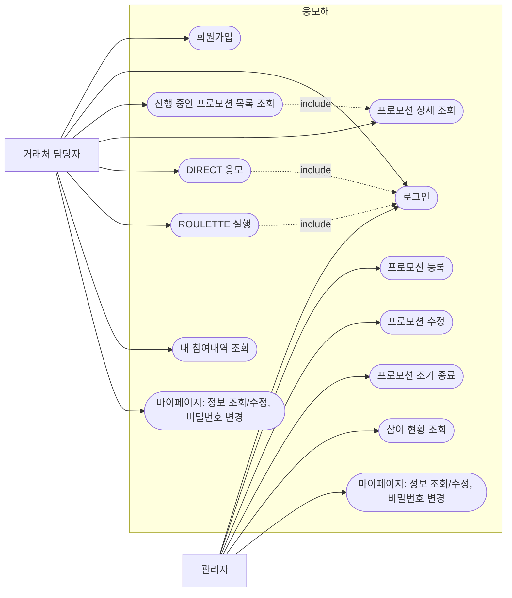

# Use Case Diagram - 응모해

## 변경이력

| 버전 | 날짜 | 변경내용 |
|------|------|----------|
| v1.0 | 2026-08-13 | 최초 작성 |

`docs/1-domain-definition.md` §6 핵심 유스케이스를 기반으로 작성.

```mermaid
flowchart LR
    User[거래처 담당자]
    Admin[관리자]

    subgraph SYS[응모해]
        UC_SIGNUP([회원가입])
        UC_LOGIN([로그인])
        UC_LIST([진행 중인 프로모션 목록 조회])
        UC_DETAIL([프로모션 상세 조회])
        UC_DIRECT([DIRECT 응모])
        UC_ROULETTE([ROULETTE 실행])
        UC_HISTORY([내 참여내역 조회])
        UC_MYPAGE_USER([마이페이지: 정보 조회/수정, 비밀번호 변경])

        UC_PROMO_CREATE([프로모션 등록])
        UC_PROMO_EDIT([프로모션 수정])
        UC_PROMO_END([프로모션 조기 종료])
        UC_STATUS([참여 현황 조회])
        UC_MYPAGE_ADMIN([마이페이지: 정보 조회/수정, 비밀번호 변경])
    end

    User --> UC_SIGNUP
    User --> UC_LOGIN
    User --> UC_LIST
    User --> UC_DETAIL
    User --> UC_DIRECT
    User --> UC_ROULETTE
    User --> UC_HISTORY
    User --> UC_MYPAGE_USER

    Admin --> UC_LOGIN
    Admin --> UC_PROMO_CREATE
    Admin --> UC_PROMO_EDIT
    Admin --> UC_PROMO_END
    Admin --> UC_STATUS
    Admin --> UC_MYPAGE_ADMIN

    UC_DIRECT -. include .-> UC_LOGIN
    UC_ROULETTE -. include .-> UC_LOGIN
    UC_LIST -. include .-> UC_DETAIL
```
