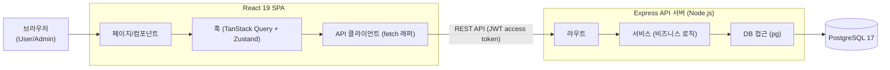
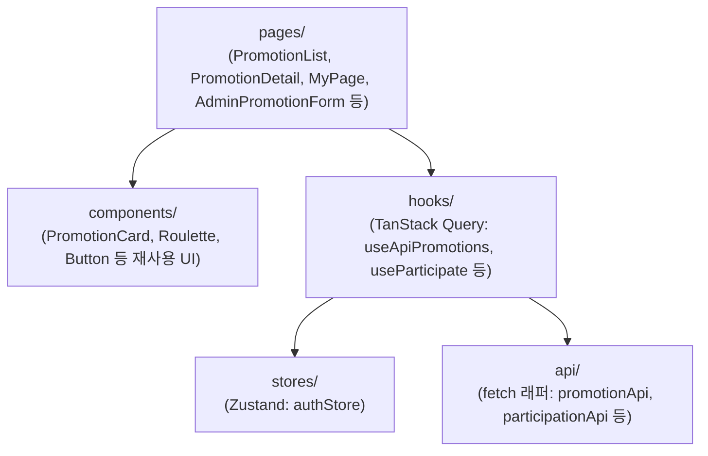

# 기술 아키텍처 다이어그램 - 응모해

## 변경이력

| 버전 | 날짜 | 변경내용 |
|------|------|----------|
| v1.0 | 2026-08-13 | 최초 작성 |
| v1.1 | 2026-08-13 | 프론트엔드 컴포넌트 구조 다이어그램 추가 |

## 구성요소 설명

- **브라우저**: 거래처 담당자(User)는 모바일, 관리자(Admin)는 데스크탑에서 반응형 UI로 접속
- **React 19 SPA**: 페이지/컴포넌트(뷰) → 훅(TanStack Query로 서버상태, Zustand로 인증 등 전역상태) → API 클라이언트 순으로 호출
- **Express API 서버**: 라우트(프레젠테이션) → 서비스(비즈니스 로직) → DB 접근(pg) 3계층, JWT access/refresh token으로 인증
- **PostgreSQL 17**: User/Admin/Promotion/Participation/ParticipationAttempt 데이터 저장, UNIQUE/FK 제약으로 도메인 규칙 보강

BFF, 마이크로서비스, 캐시 레이어(Redis 등), API Gateway, 메시지 큐는 사용하지 않는다.

## 프론트엔드 컴포넌트 구조

- **pages**: 라우트 단위 화면. components/hooks를 조합해 화면을 구성
- **components**: 여러 페이지에서 재사용하는 순수 UI 조각, 상태·API 호출 없음
- **hooks**: TanStack Query로 서버 상태(프로모션/참여내역)를 가져오고, 필요 시 Zustand 상태를 함께 참조
- **stores**: Zustand 전역 상태(로그인 유저, access token 등)
- **api**: 실제 fetch 호출을 감싼 함수 모음, hooks에서만 호출
