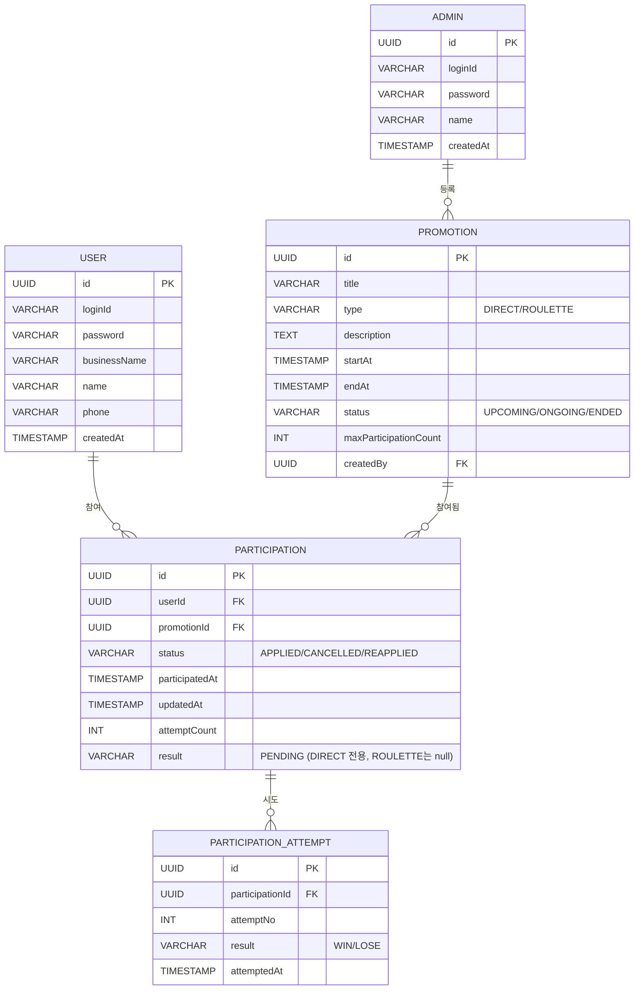

# ERD - 응모해

## 변경이력

| 버전 | 날짜 | 변경내용 |
|------|------|----------|
| v1.0 | 2026-08-13 | 최초 작성: User, Admin, Promotion, Participation, ParticipationAttempt 5개 엔티티 ERD 정의 |
| v1.1 | 2026-08-13 | DB 제약 보강 문단의 FK 설명 오류 수정(테이블별로 분리 서술), camelCase/snake_case 개념모델 안내 추가 |

## ERD

> (User, Promotion) 조합당 Participation은 유일 — 1건만 존재한다(다이어그램 표기상 1:N 카디널리티로는 직접 표현되지 않음).

## DB 제약 보강

- **규칙3 (참여신청 유일성)**: `PARTICIPATION`에 `UNIQUE (userId, promotionId)` 제약을 두어 (회원, 프로모션) 조합당 레코드가 1건만 존재하도록 DB 레벨에서 강제한다.
- **규칙4 (재추첨 불가)**: `PARTICIPATION_ATTEMPT`는 UPDATE/DELETE를 허용하지 않는 append-only 테이블로 운용한다(애플리케이션 레벨 금지 + 트리거로 보강, `8-schema.sql` 참조).
- **참조 무결성**: `PARTICIPATION_ATTEMPT.participationId` → `PARTICIPATION.id`, `PARTICIPATION.userId` → `USER.id`, `PARTICIPATION.promotionId` → `PROMOTION.id`, `PROMOTION.createdBy` → `ADMIN.id`, 각각 소속 테이블에서 FK로 참조 무결성을 보장한다.

> 본 다이어그램은 개념 모델이며, 실제 물리 컬럼명은 snake_case를 사용한다(`5-project-principle.md` §3, `8-schema.sql` 참조).
