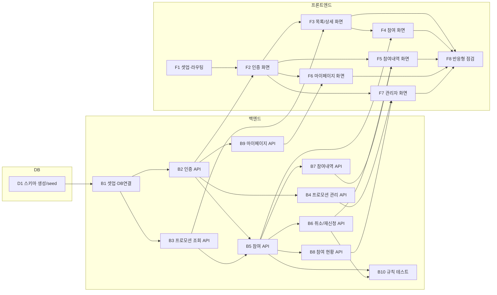

# 실행계획 - 응모해

## 변경이력

| 버전 | 날짜 | 변경내용 |
|------|------|----------|
| v1.0 | 2026-08-13 | 최초 작성: DB/백엔드/프론트엔드 Task 분해 및 실행계획 수립 |
| v1.1 | 2026-08-13 | Task 의존관계도(mermaid) 추가 |
| v1.2 | 2026-08-13 | swagger.json과의 정합성 반영: B8 완료조건에 result 필드 추가, B3 필드명 주석(myAttemptCount), B4에 PRD §8 일정 표기 차이 설명 추가 |
| v1.3 | 2026-08-13 | D1 수행 완료: postgresql-mcp로 5개 테이블·UNIQUE 제약·append-only 트리거 검증, Admin seed 계정 생성. D1 완료 조건 4개 모두 체크 |

`docs/1-domain-definition.md`(엔티티·규칙), `docs/2-PRD.md`(§5 우선순위·§8 3일 일정), `docs/5-project-principle.md`(디렉토리 구조·레이어), `docs/7-wireframe.md`(화면), `docs/8-erd.md`·`docs/8-schema.sql`(스키마)을 전제로 작성.

## Task 개요

| ID | 영역 | Task | 선행 Task | 일정 |
|----|------|------|-----------|------|
| D1 | DB | 스키마 생성 및 seed | - | Day 1 |
| B1 | 백엔드 | 프로젝트 셋업 · DB 연결 | D1 | Day 1 |
| B2 | 백엔드 | 인증 API (회원가입/로그인/토큰재발급) | B1 | Day 1 |
| B3 | 백엔드 | 프로모션 조회 API (User) | B1 | Day 1 |
| B4 | 백엔드 | 프로모션 관리 API (Admin) | B2 | Day 1 |
| B5 | 백엔드 | 프로모션 참여 API (DIRECT/ROULETTE) | B2, B3 | Day 2 |
| B6 | 백엔드 | 참여 취소/재신청 API | B5 | Day 2 |
| B7 | 백엔드 | 내 참여내역 API | B5 | Day 2 |
| B8 | 백엔드 | 관리자 참여 현황 API | B5 | Day 3 |
| B9 | 백엔드 | 마이페이지 API (정보수정/비밀번호변경) | B2 | Day 3 |
| B10 | 백엔드 | 핵심 비즈니스 규칙 테스트 | B5, B6 | Day 2~3 |
| F1 | 프론트 | 프로젝트 셋업 · 라우팅 · API 클라이언트 | - | Day 1 |
| F2 | 프론트 | 인증 화면 · authStore | F1, B2 | Day 1 |
| F3 | 프론트 | 프로모션 목록/상세 화면 | F2, B3 | Day 1 |
| F4 | 프론트 | 참여 화면 (DIRECT 응모 / ROULETTE 룰렛) | F3, B5 | Day 2 |
| F5 | 프론트 | 내 참여내역 화면 (취소/재신청 포함) | F2, B6, B7 | Day 2~3 |
| F6 | 프론트 | 마이페이지 화면 | F2, B9 | Day 3 |
| F7 | 프론트 | 관리자 화면 (등록/수정/목록관리/현황) | F2, B4, B8 | Day 3 |
| F8 | 프론트 | 반응형 스타일 점검 | F3~F7 | Day 3 |

## Task 의존관계도

---

## D1. DB 스키마 생성 및 seed

**선행 Task**: 없음

**작업 내용**
- PostgreSQL 17 데이터베이스 생성
- `docs/8-schema.sql` 실행하여 5개 테이블 생성
- Admin 초기 계정 seed 스크립트 작성 (`backend/src/seed/`)

**완료 조건**
- [x] `users`, `admins`, `promotions`, `participations`, `participation_attempts` 5개 테이블이 생성됨
- [x] `participations`에 `UNIQUE (user_id, promotion_id)` 제약이 존재함 (규칙3)
- [x] `participation_attempts`에 UPDATE/DELETE 차단 트리거가 동작함 (규칙4) — UPDATE 시도 시 예외 발생 확인
- [x] Admin 계정 1건이 seed로 생성되고 bcrypt 해시로 저장됨

---

## B1. 백엔드 프로젝트 셋업 · DB 연결

**선행 Task**: D1

**작업 내용**
- `backend/` 프로젝트 초기화 (Express, pg, jsonwebtoken, bcrypt, cors, dotenv)
- `src/db/pool.js` — pg Pool 설정
- `src/app.js` — Express 앱, CORS, JSON 파서, 공통 에러 핸들러
- `.env.example` 작성 (`DATABASE_URL`, `JWT_ACCESS_SECRET`, `JWT_REFRESH_SECRET`, `PORT`)

**완료 조건**
- [ ] `npm start`로 서버가 기동됨
- [ ] DB 연결 확인용 요청이 정상 응답함
- [ ] 에러 응답이 `{ code, message }` 형태로 통일됨
- [ ] `.env`가 git에 포함되지 않음

---

## B2. 인증 API

**선행 Task**: B1

**작업 내용**
- `POST /auth/signup` — User 회원가입 (Admin은 회원가입 없음, seed로만 생성)
- `POST /auth/login` — User/Admin 공통 로그인, access/refresh token 발급
- `POST /auth/refresh` — refresh token으로 access token 재발급
- `src/middlewares/authMiddleware.js` — access token 검증, 요청에 사용자/역할 주입

**완료 조건**
- [ ] 회원가입 시 비밀번호가 bcrypt 해시로 저장됨 (평문 저장/로깅 없음)
- [ ] 중복 `loginId` 가입 시도가 거부됨
- [ ] 로그인 성공 시 access token(단기)과 refresh token(장기)이 함께 발급됨
- [ ] 만료/위조된 access token으로 보호된 API 호출 시 401 응답
- [ ] refresh token으로 새 access token을 재발급받을 수 있음
- [ ] authMiddleware가 User/Admin 역할을 구분해 주입함

---

## B3. 프로모션 조회 API (User)

**선행 Task**: B1

**작업 내용**
- `GET /promotions` — 진행중(ONGOING) 프로모션 목록
- `GET /promotions/:id` — 프로모션 상세
- `status`는 `startAt`/`endAt`과 현재시각 기준으로 산정 (도메인 정의서 §5)

**완료 조건**
- [ ] 목록 API가 ONGOING 상태 프로모션만 반환함
- [ ] 상세 API가 title, type, description, startAt, endAt, status, maxParticipationCount를 반환함
- [ ] ROULETTE 상세 조회 시 로그인 사용자의 현재 `attemptCount`가 함께 반환됨 (잔여 횟수 표시용, API 응답 필드명은 `swagger.json` 기준 `myAttemptCount`)

---

## B4. 프로모션 관리 API (Admin)

**선행 Task**: B2

> 참고: PRD §8 일정표는 "등록"을 Day1, "수정/조기종료"를 Day3로 구분 표기하지만, 이는 화면(F7) 노출 시점 기준이다. API(B4)는 등록/수정/조기종료를 한 번에 Day1에 구현하고, 수정·조기종료 화면(F7)만 Day3에 붙인다.

**작업 내용**
- `POST /admin/promotions` — 등록 (`createdBy` = 로그인 Admin)
- `PUT /admin/promotions/:id` — 수정
- `PATCH /admin/promotions/:id/end` — 조기 종료 (status → ENDED)
- `GET /admin/promotions` — 전체 프로모션 목록 (상태 무관)

**완료 조건**
- [ ] Admin 토큰 없이 호출 시 403으로 거부됨 (규칙8)
- [ ] 등록 시 startAt/endAt 기준으로 status가 UPCOMING 또는 ONGOING으로 자동 산정됨
- [ ] ROULETTE 등록 시 `maxParticipationCount`가 1 이상으로 저장되고, DIRECT는 1로 고정됨
- [ ] 조기 종료 후 해당 프로모션의 status가 ENDED이고, 기존 Participation/ParticipationAttempt는 변경되지 않음 (규칙9)

---

## B5. 프로모션 참여 API

**선행 Task**: B2, B3

**작업 내용**
- `POST /promotions/:id/participate` — DIRECT 응모
- `POST /promotions/:id/roulette` — ROULETTE 시도 (Participation 없으면 생성 후 시도)
- 참여 생성/시도 증가/Attempt 생성은 하나의 트랜잭션으로 처리
- 룰렛 당첨 판정 로직 (MVP: 고정 확률 기반 난수)

**완료 조건**
- [ ] 비로그인 요청이 401로 거부됨 (규칙1)
- [ ] UPCOMING/ENDED 프로모션 참여 요청이 거부됨 (규칙2)
- [ ] DIRECT 응모 시 Participation이 status=APPLIED, attemptCount=1, result=PENDING으로 생성됨
- [ ] DIRECT에서 이미 APPLIED/REAPPLIED 상태인 사용자의 재응모가 거부됨 (규칙5)
- [ ] ROULETTE 시도마다 attemptCount가 1 증가하고 ParticipationAttempt가 1건 생성되며 WIN/LOSE가 즉시 확정됨 (규칙6)
- [ ] attemptCount가 maxParticipationCount에 도달하면 추가 시도가 거부됨 (규칙6)
- [ ] 동일 사용자의 동시 요청에서도 (user, promotion) 조합 Participation이 2건 생성되지 않음 (규칙3, UNIQUE 제약으로 방어)

---

## B6. 참여 취소/재신청 API

**선행 Task**: B5

**작업 내용**
- `PATCH /participations/:id/cancel` — status → CANCELLED
- `PATCH /participations/:id/reapply` — status → REAPPLIED

**완료 조건**
- [ ] 취소/재신청 시 새 레코드가 생성되지 않고 기존 레코드의 status만 전환됨 (규칙3)
- [ ] 재신청은 프로모션이 ONGOING일 때만 허용됨 (규칙2, `4-user-scenario.md` §4)
- [ ] 재신청 후에도 기존 ParticipationAttempt 결과가 그대로 유지됨 (규칙4)
- [ ] 본인 소유가 아닌 Participation에 대한 요청이 거부됨

---

## B7. 내 참여내역 API

**선행 Task**: B5

**작업 내용**
- `GET /me/participations` — 로그인 사용자의 참여내역 목록
- DIRECT는 `result`, ROULETTE는 회차별 ParticipationAttempt 목록을 포함

**완료 조건**
- [ ] 프로모션명, 참여방식, 참여일시, status가 반환됨
- [ ] ROULETTE 항목에 회차별(attemptNo) WIN/LOSE 결과가 포함됨
- [ ] ENDED 프로모션의 참여내역도 계속 조회됨 (규칙7)

---

## B8. 관리자 참여 현황 API

**선행 Task**: B5

**작업 내용**
- `GET /admin/promotions/:id/participations` — 참여자 목록 및 집계

**완료 조건**
- [ ] 총 참여자 수와 참여자별(사업체명/담당자/상태/결과/참여일) 목록이 반환됨 (`7-wireframe.md` §11)
- [ ] ROULETTE 프로모션은 WIN/LOSE 집계가 함께 반환됨
- [ ] Admin 토큰 없이 호출 시 거부됨

---

## B9. 마이페이지 API

**선행 Task**: B2

**작업 내용**
- `GET /me` / `PUT /me` — 내 정보 조회·수정 (User: businessName/name/phone, Admin: name)
- `PUT /me/password` — 비밀번호 변경 (현재 비밀번호 검증 후 변경)

**완료 조건**
- [ ] User/Admin 모두 자신의 정보를 조회·수정할 수 있음
- [ ] 현재 비밀번호가 틀리면 변경이 거부됨
- [ ] 변경된 비밀번호가 bcrypt 해시로 저장되고, 새 비밀번호로 로그인됨

---

## B10. 핵심 비즈니스 규칙 테스트

**선행 Task**: B5, B6

**작업 내용**
- `5-project-principle.md` §4 표의 5개 규칙에 대한 최소 테스트 작성 (프레임워크 없이 assert 기반 스크립트 가능)

**완료 조건**
- [ ] (Promotion, User) 조합당 Participation 유일성 검증 (규칙3)
- [ ] DIRECT 중복응모 거부 검증 (규칙5)
- [ ] ROULETTE maxParticipationCount 초과 거부 검증 (규칙6)
- [ ] 확정된 ParticipationAttempt 수정 불가 검증 (규칙4)
- [ ] UPCOMING/ENDED 프로모션 참여 거부 검증 (규칙2)
- [ ] 전체 테스트가 한 번의 명령으로 실행되고 통과함

---

## F1. 프론트엔드 셋업 · 라우팅 · API 클라이언트

**선행 Task**: 없음 (B1과 병행 가능)

**작업 내용**
- `frontend/` 초기화 (React 19, Zustand, TanStack Query, 라우터)
- `src/api/` — fetch 래퍼, access token 자동 첨부, 401 시 refresh 재시도
- `src/router.tsx` — 라우트 정의, 인증 보호 라우트 처리
- `src/types/` — 도메인 타입 정의

**완료 조건**
- [ ] 개발 서버가 기동되고 빈 라우트가 렌더링됨
- [ ] QueryClientProvider가 앱 최상단에 설정됨
- [ ] API 클라이언트가 access token을 자동 첨부하고, 401 시 refresh 후 1회 재시도함
- [ ] 미인증 상태로 보호 라우트 접근 시 로그인 화면으로 리다이렉트됨

---

## F2. 인증 화면 · authStore

**선행 Task**: F1, B2

**작업 내용**
- 회원가입 화면 (`7-wireframe.md` §1)
- 로그인 화면 (§2, User/Admin 공통)
- `src/stores/authStore.ts` — 로그인 사용자, 역할, 토큰 보관

**완료 조건**
- [ ] 회원가입 후 로그인 화면으로 이동함
- [ ] 로그인 성공 시 User는 프로모션 목록, Admin은 프로모션 관리 화면으로 이동함
- [ ] 새로고침 후에도 로그인 상태가 유지됨
- [ ] 로그인 실패 시 원인을 알 수 있는 오류 메시지가 표시됨

---

## F3. 프로모션 목록/상세 화면

**선행 Task**: F2, B3

**작업 내용**
- 프로모션 목록 화면 (§3) — 카드형, DIRECT/ROULETTE 배지
- 프로모션 상세 화면 (§4) — 타입별 하단 액션 분기

**완료 조건**
- [ ] ONGOING 프로모션만 카드로 표시되고, title/type/기간이 노출됨
- [ ] 카드 클릭 시 상세 화면으로 이동함
- [ ] 상세에서 기간/혜택/참여조건/참여방식/유의사항이 표시됨
- [ ] ROULETTE 상세에 잔여 시도 횟수가 표시됨

---

## F4. 참여 화면 (DIRECT / ROULETTE)

**선행 Task**: F3, B5

**작업 내용**
- DIRECT 응모 버튼 및 결과 표시
- ROULETTE 실행 UI와 결과 표시 (§5)

**완료 조건**
- [ ] DIRECT 응모 성공 시 응모 완료(PENDING)가 표시됨
- [ ] 중복 응모 시도 시 거부 사유가 화면에 표시됨
- [ ] 룰렛 실행 후 WIN/LOSE 결과와 회차, 잔여 횟수가 표시됨
- [ ] 잔여 횟수 소진 시 실행 버튼이 비활성화되거나 노출되지 않음
- [ ] 참여 요청 중 중복 클릭으로 2건이 생성되지 않음

---

## F5. 내 참여내역 화면

**선행 Task**: F2, B6, B7

**작업 내용**
- 참여내역 목록 (§6) — 모바일 카드 / 데스크탑 표
- 취소·재신청 액션

**완료 조건**
- [ ] 프로모션명, 참여방식, status, 참여일이 표시됨
- [ ] ROULETTE 항목에 회차별 WIN/LOSE가 표시됨
- [ ] 취소 시 status가 CANCELLED로 갱신되어 화면에 반영됨
- [ ] 재신청 시 status가 REAPPLIED로 갱신되고, 기존 룰렛 결과는 유지됨
- [ ] ENDED 프로모션의 내역도 조회됨

---

## F6. 마이페이지 화면

**선행 Task**: F2, B9

**작업 내용**
- 마이페이지 (§7) — 정보 수정, 비밀번호 변경, 참여내역 진입

**완료 조건**
- [ ] 내 정보가 조회되고 수정 후 저장이 반영됨
- [ ] 비밀번호 변경이 성공하고, 새 비밀번호로 재로그인됨
- [ ] User에게만 "내 참여내역 보기"가 노출됨

---

## F7. 관리자 화면

**선행 Task**: F2, B4, B8

**작업 내용**
- 프로모션 등록/수정 폼 (§9)
- 프로모션 목록 관리 (§10) — 수정/조기종료/현황 액션
- 참여 현황 조회 (§11)

**완료 조건**
- [ ] 등록 폼에서 type이 ROULETTE일 때만 maxParticipationCount 입력이 노출됨
- [ ] 등록/수정이 목록에 즉시 반영됨
- [ ] 조기 종료는 ONGOING 프로모션에만 노출되고, 실행 시 상태가 ENDED로 바뀜
- [ ] 참여 현황에서 참여자 수와 참여자 목록이 표시되고, ROULETTE는 당첨 현황이 함께 표시됨

---

## F8. 반응형 스타일 점검

**선행 Task**: F3~F7

**작업 내용**
- `7-wireframe.md`의 모바일/데스크탑 레이아웃 대조 점검

**완료 조건**
- [ ] User 화면이 모바일 폭에서 가로 스크롤 없이 표시됨
- [ ] Admin 표 화면이 좁은 폭에서 카드 형태로 전환되거나 컨테이너 내부에서만 가로 스크롤됨
- [ ] 모든 화면이 모바일/데스크탑 두 폭에서 레이아웃 깨짐 없이 표시됨

---

## 리스크

- Day 1에 D1·B1·B2·B3·B4·F1·F2가 몰려 있어 가장 부하가 큼. 지연 시 B4(관리자 프로모션 관리)를 Day 2로 이월하고, 프로모션 데이터는 seed로 대체해 F3~F4를 먼저 진행한다.
- Should 등급(B8, B9, F5~F7)은 Day 3 소진 시 다음 이터레이션으로 이월한다 (PRD §9).
- 룰렛 애니메이션 UI는 결과 표시(텍스트) 우선 구현 후, 시간이 남을 때 연출을 추가한다.
